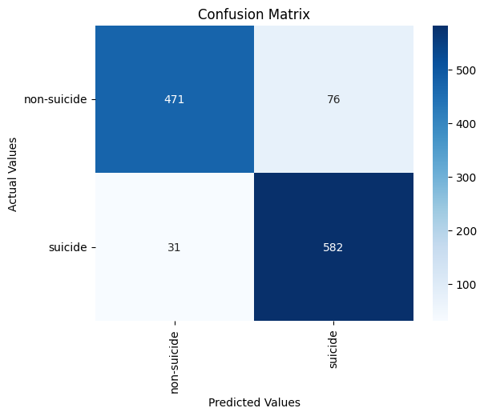

Creating a Suicide Text Classification Model Augmented with a Pre-trained Transformer
==============================
This is a submission of **final paper** for the **CIS737** course.

It contains the code necessary to implement a pre-trained transformer model to predict whether a text infers suicidal
thoughts or not.

The dataset from the [Suicide and Depression Detection](https://www.kaggle.com/datasets/nikhileswarkomati/suicide-watch)
has been used.


Collaborators 🥇
------------

* Tariq Sha'ban
* Hamzeh Hailat

Getting Started
------------
Clone the project from GitHub

`$ git clone https://github.com/tariqshaban/suicide-detection.git`

No further configuration is required.


Usage
------------
* Navigate to the `defining constants` section and specify the following hyperparameters:
    * Sampling fraction, set to 1
    * Validation ratio, set to 0.01
    * Test ratio, set to 0.005
    * Batch size, set to 2 (Due to computational limitation)
    * Number of epochs, set to 300
    * Early stopping value, set to 30
    * Early stopping delta value, set to 0.001

The following methods should be invoked to build and evaluate the model:

``` python
# Fetches the distilbert-base-uncased tokenizer
tokenizer = get_tokenizer()

# Ready the dataset for training
tokenized_dataset, test_dataset = prime_dataset(tokenizer=tokenizer)

# Trains the model
model = train_model(tokenizer=tokenizer, tokenized_dataset=tokenized_dataset, test_dataset=test_dataset)
```

``` python
# Returns a pipeline from the trained model; based on the MODEL_OUTPUTD.
trained_pipeline = get_trained_pipeline()
```

``` python
# Predict a text whether it is suicidal or not
text = 'A sample text.'
trained_pipeline(text, truncation=True, max_length=4096)
```

The following computational resources were used for training the model:

|     | Resource                       |
|-----|--------------------------------|
| CPU | Ryzen 5 3600                   |
| GPU | Nvidia RTX 2060 6GB GDDR6 VRAM |
| RAM | 24GB DDR4                      |

> **Note**: The training process on these resources took approximately less than four days. However, it should be noted
> that the training time for each epoch fluctuated considerably; this is caused by having the resources used for other tasks as well.

Findings
------------

> ### Model Performance
> 
> 
>
> The lowest loss achieved during the training process was at the first epoch (0.0850). Such a result indicates that the
> pre-trained initial weights were near-optimal; or that the hyperparameters should be further tuned.
>
> 
>
> The model has a relatively higher error rate in discriminating texts that are not suicidal but perceived as one.

Notes
------------

> **Note**: Due to the computational limitations, we could not drop the weights of the pre-trained model; since by doing
> so, the number of epochs required to converge will significantly increase.

--------