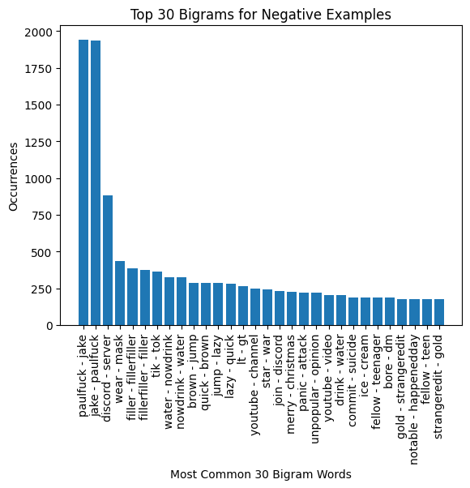
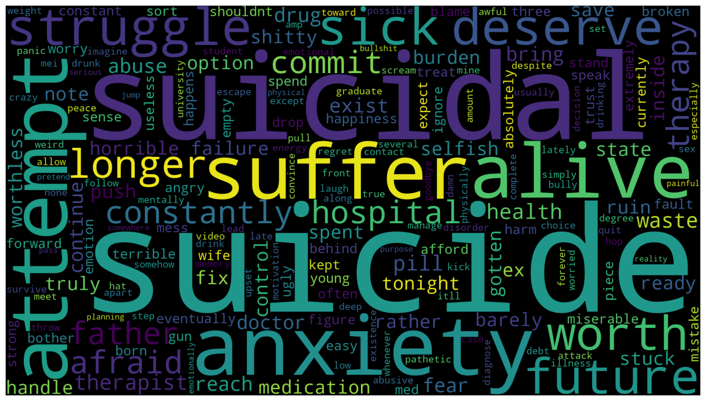
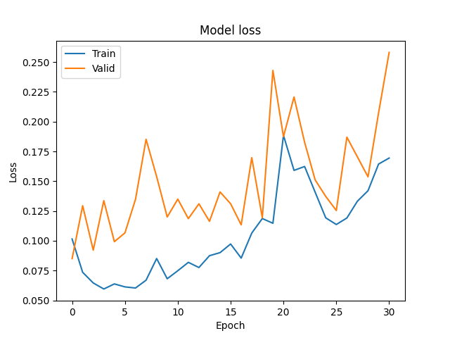

Creating a Suicide Text Classification Model Augmented with a Pre-trained Transformer
==============================
This is a submission of **final paper** for the **CIS737** course.

It contains the code necessary to implement a pre-trained transformer model to predict whether a text infers suicidal
thoughts or not.

The dataset from the [Suicide and Depression Detection](https://www.kaggle.com/datasets/nikhileswarkomati/suicide-watch)
has been used, which contains a total of 232 thousand instances of nearly perfectly balanced classes (50% non-suicidal,
50% suicidal).


Collaborators 🥇
------------

* Tariq Sha'ban
* Hamzeh Hailat

Getting Started
------------
Clone the project from GitHub

`$ git clone https://github.com/tariqshaban/suicide-detection.git`

No further configuration is required.


Usage
------------

* Navigate to the `defining constants` section and specify the following hyperparameters:
    * Sampling fraction, set to 1
    * Validation ratio, set to 0.01
    * Test ratio, set to 0.005
    * Batch size, set to 2 (Due to computational limitation)
    * Number of epochs, set to 300
    * Early stopping value, set to 30
    * Early stopping delta value, set to 0.001

The following methods should be invoked to build and evaluate the model:

``` python
# Fetches the distilbert-base-uncased tokenizer
tokenizer = get_tokenizer()

# Ready the dataset for training
tokenized_dataset, test_dataset = prime_dataset(tokenizer=tokenizer)

# Trains the model
model = train_model(tokenizer=tokenizer, tokenized_dataset=tokenized_dataset, test_dataset=test_dataset)
```

``` python
# Returns a pipeline from the trained model; based on the MODEL_OUTPUTD.
trained_pipeline = get_trained_pipeline()
```

``` python
# Predict a text whether it is suicidal or not
text = 'A sample text.'
trained_pipeline(text, truncation=True, max_length=4096)
```

The following computational resources were used for training the model:

|         | Resource                       |
|:-------:|--------------------------------|
| **CPU** | Ryzen 5 3600                   |
| **GPU** | Nvidia RTX 2060 6GB GDDR6 VRAM |
| **RAM** | 24GB DDR4                      |

> **Note**: The training process on these resources took approximately less than four days. However, it should be noted
> that the training time for each epoch fluctuated considerably; this is caused by having the resources used for other
> tasks as well.

Dataset Exploration
------------

> **Note**: The suicidal classes as positive labels, while the non-suicidal classes as negative labels

> <p>
>   
>   
> </p>
>
> While comparing the word length distribution for each post with respect to the negative examples, the positive
> examples have significantly more words per post. Both distributions are skewed to the right.
>
> <p>
>   
>   
> </p>
>
> The positive examples have an overwhelming ratio of negative sentiment. Note that having negative sentiment does not
> necessarily mean that the text has suicidal thoughts.
>
> <p>
>   
>   
> </p>
>
> Notice that the positive examples have suicide-related words, while the negative examples have miscellaneous words.
>
> <p>
>   
>   
> </p>
>
> The most common bigram in the positive examples is **commit suicide** and **attempt suicide**.
>
> <p>
>   
>   
> </p>
>
> The most common trigram in the positive examples is **borderline personality disorder**, which is very common among
> depressed people.
>
> <p>
>   
>   
> </p>
>
> Another representation for the top **N** words; where the left figure denotes positive examples, and the right figure
> denotes negative examples.

Model Construction
------------

The `distilbert-base-uncased` pre-trained model has been used, the model weights and architecture can be accessed
[here](https://huggingface.co/distilbert-base-uncased).

`distilbert-base-uncased` is the result of this [paper](https://arxiv.org/abs/1910.01108); the authors have trained
their model based on the same corpus as the original BERT model, which consisted of:

* English Wikipedia
* Toronto Book Corpus

All the layers of the model were trainable (66,955,010 parameters).


Findings
------------

> ### Model Performance
>
> 
>
> The lowest loss achieved during the training process was at the first epoch (0.0850). Such a result indicates that the
> pre-trained initial weights were near-optimal; or that the hyperparameters should be further tuned.
>
> 
>
> The model has a relatively higher error rate in discriminating texts that are not suicidal but perceived as one.
>
> The testing dataset reported the following evaluation metric results:
> * Accuracy: 90.94%
> * Precision: 86.75%
> * Recall: 96.93%
> * F1 Score: 91.56%

Notes
------------

> **Note**: Due to the computational limitations, we could not drop the weights of the pre-trained model; since by doing
> so, the number of epochs required to converge will significantly increase.

--------